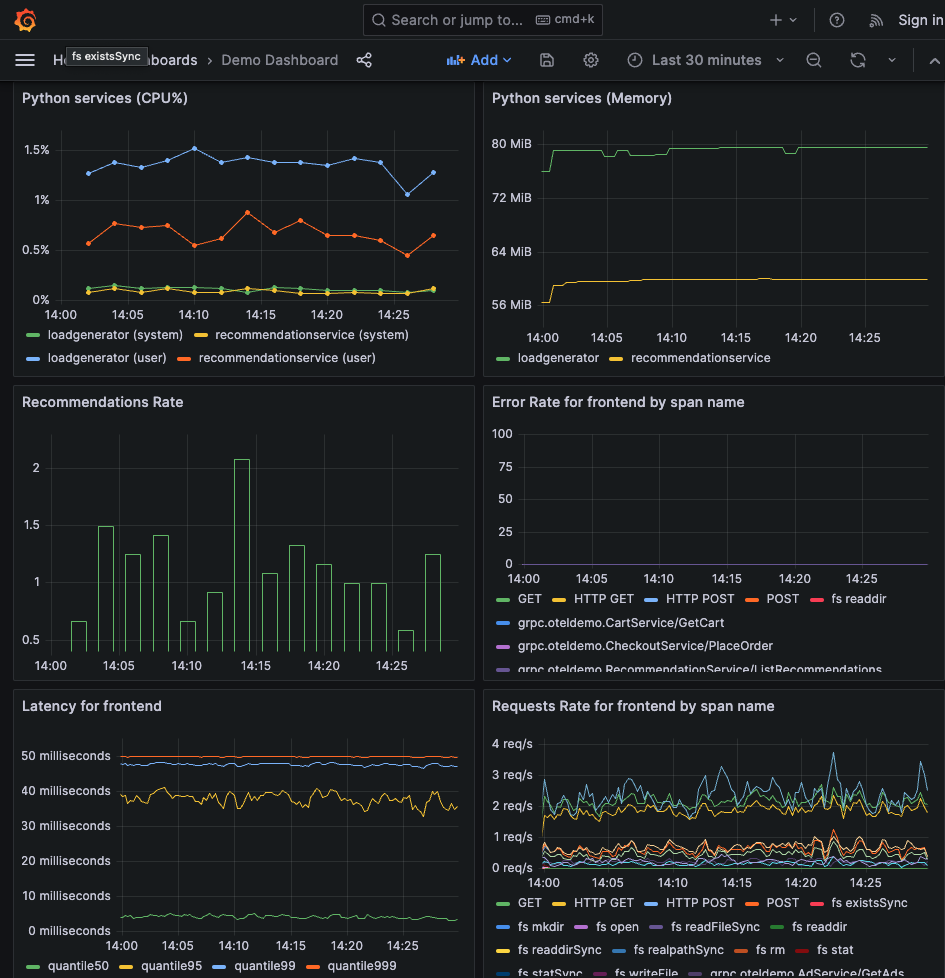

# Get up and running with CCO as fast as possible

```
contact: Eric Kalosa-Kenyon <ekquasar@cisco.com>
audience: developers, devops, application developers
keywords: observability, monitoring, metrics, traces, logs, kubernetes, docker, helm, opentelemetry, cisco cloud observability, cco
tested on: Dec 14, 2023
```

# 1. Introduction


^ excerpted from the [Cisco Cloud Observability docs](https://docs.appdynamics.com/fso/cloud-native-app-obs/en/kubernetes-and-app-service-monitoring).


^ exc. [COO docs](https://docs.appdynamics.com/fso/cloud-native-app-obs/en/application-performance-monitoring/monitor-applications-in-kubernetes#MonitorApplicationsinKubernetes-GetStarted)

In this post, I'll show you how to go from nothing running on your laptop to a
fully instrumented demo app exporting observability data to Cisco's Cloud
Observability (CCO) platform.

## 1a. Overview
My goal is to get you up and running with CCO as fast as possible. Here is how we'll do that:

1. Install otel demo on Docker Desktop using helm (§2)
2. Get your credentials from an admin on your CCO account (§3a)
3. Update the otel collector's ConfigMap with the credentials and restart it (§3b)

### How long will this take?
- 15 minutes to install the demo app
- It depends on your admin how long it will take to get CCO credentials
- 5 minutes to patch the ConfigMap and restart the collector
- 5 minutes to verify the collector is exporting to CCO

Total time: 25-30 minutes, plus waiting for credentials.

### Conventions
- "👋 lorem ipsum ..." indicates you can skip a section. 

## 1b. Assumed background
- Familiarity with Kubernetes concepts like Deployments
- Familiarity with application monitoring concepts like metrics and traces

## 1c. Glossary
👋 Gloss over this unless you find a term you don't know.

- _OpenTelemetry_: aka "otel", an open-source CNCF implementation of an observability data protocol and transport
  tooling. At the project scope it is broad in scope, including various components from application and
  infrastructure instrumentation packages to data export agents. This project will provide our "observability toolbox".
- _OTLP_: (OpenTelemetry Protocol) the protocol otel uses.
- _MELT_: (Metrics, Events, Logs, Traces) otherwise known as "observability data", these are what we'll
  use to monitor our apps.
- _Tenant_: in CCO, "tenant" refers to your (company's) account. Your tenant has a UUID that you'll
  see in various places - it can be helpful to remember its first 6 characters.
- _APM metrics_: (Application Performance Monitoring) metrics that are specific to the application
  code, like latency, error rate, and throughput. In CCO, those metrics are named and namespaced like this:
  ```json
  "apm:calls_min",
  "apm:response_time",
  "apm:errors_min"
  ```

## 1d. Pre-requisites


### Tools installed on your workstation
- Docker Desktop with Kubernetes enabled
- kubectl, helm, jq
- optionally, k9s

### Access pre-requisites
- 🫱🏾‍🫲🏿 an active CCO trial or subscription
- 🔐 either admin access to the CCO UI or a friendly admin

### Information
- Your CCO tenant ID e.g. `5c187138-8a73-4982-b9a5-a8bcc8681b5f`

## 1e. Disclaimers
I tested this:
- on macOS Sonoma 14.1.2
- with Kubernetes v1.28.2
- running on Docker Desktop 4.25.2
- with Docker Engine v24.0.6
- installed by `helm.sh/chart: opentelemetry-collector-0.73.1`
- resulting in an otel-collector with image `otel/opentelemetry-collector-contrib:0.88.0`.
- on December 13, 2023

YMMV. Please reach out via email if something is broken.

# 2. Out-of-the-box instrumented demo
At the end of this section, you'll have a demo web shopping app running with a load generator and
all the monitoring bells and whistles included.


^ excerpted from the [CCO docs](https://docs.appdynamics.com/fso/cloud-native-app-obs/en/application-performance-monitoring/monitor-applications-in-kubernetes/configure-applications-running-outside-of-a-supported-kubernetes-cluster).

## 2a. Get the demo running
Following the [otel
docs](https://opentelemetry.io/docs/demo/kubernetes-deployment/#install-using-helm-recommended) It's
as easy as "do re mi":
```sh
kubectl create ns my-otel-demo-ns
helm repo add open-telemetry https://open-telemetry.github.io/opentelemetry-helm-charts
helm install -n my-otel-demo-ns my-otel-demo open-telemetry/opentelemetry-demo
```

### Expected output


Now you just need to let the application components download for up to 15
minutes, depending on network conditions. ☕️🫖😌

### Expected deployments
Once the demo is running, you should see these deployments spun up in the default namespace:

```yaml
# hint: in k9s, press <:> to enter command mode.
# Type "deploy" and press <enter> to select.
# Now you should see the Deployments view.
```
Notice that the otel collector is running. This is the component that will both
collect and export observability data.


## 2b. Try out the demo app
👋 You can safely skip this subsection.

Again, following the docs linked above, once the demo app spins up, you can access it via the
`frontendproxy` component. Just port-forward it to localhost like this:
```
kubectl port-forward -n my-otel-demo-ns svc/my-otel-demo-frontendproxy 8080:8080
```
or in k9s:

```yaml
# hint: in k9s, <shift-f> in the Pods view opens the port-forward dialog.
# Press <down> to select the "OK" button and press <enter> to confirm.
```

Visit `localhost:8080` to poke around the shop:


<!-- ffmpeg -i shopping-demo-app.mov -s 600x400 -pix_fmt rgb24 -r 10 -f gif - | gifsicle --optimize=3 --delay=3 > shopping-demo-app.gif -->

You can also see the load generator doing work by checking Grafana:


```yaml
# hint: with the frontendproxy port-forwarded to localhost:8080,
# you can access grafana at "localhost:8080/grafana"
```

Now we've got a working demo running on our laptops. Next let's export the metrics data to CCO.

# 3. Export observability data to CCO

At the end of this section, you will have the otel collector exporting observability data to CCO.


## 3a. Get CCO credentials
In the CCO UI, navigate to the "Kubernetes and APM" section. There, if you have admin access, you
can provision the credentials required to send data to CCO.


You will get two files:
- `collector-values.yaml` used to provide credentials and other config to the otel collector.
- `operator-values.yaml` used to provide the same information in a different format to the
  kubernetes operator.

We only need the `collector-values.yaml` for this blog.

### What's in `collector-values.yaml`?
👋 This is a detail you can skip unless you're curious.

If you peek inside, you will see:
```yaml
global:
  clusterName: <my cluster name>
# many commented config options, we don't need them so leave 'em alone.
# ...
# all the way at the bottom:
appdynamics-otel-collector:
  clientId: <my client ID>
  clientSecret: <my client Secret>
  endpoint: https://<tenant friendly name>.observe.appdynamics.com
  tokenUrl: https://<tenant friendly name>.observe.appdynamics.com/oauth/token
```
Notice the access keys and endpoint urls. 
In the next subsection, we will merge these credentials into the otel-collector's ConfigMap.


## 3b. Configure the collector to export to CCO
To get the otel collector to export to CCO, we need the oauth2 extension enabled. 
Fortunately, the collector flavor included in the otel demo is `contrib`, which
has this extension installed out of the box! Now we just need to configure it.

### 📝 collectors in production
👋 This is a detail you can skip unless you are deploying at scale.

There's a little complexity hidden here: there are tons of ways to set up your collector depending
on your needs. We can start with the "everything installed" version named `contrib` to make the development process easier. In a production environment, you would likely
prefer a collector with a smaller footprint - so you'd want to dig into the details on that then.
For more details, see the [otel collector builder docs](https://opentelemetry.io/docs/collector/custom-collector/).

For this demo use-case, the `contrib` collector flavor will do fine.

### i. Get your otel-collector's ConfigMap
```sh
kubectl get configmap \
  -n my-otel-demo-ns \
  my-otel-demo-otelcol \
  -o yaml \
  > my-otel-demo-otelcol.yaml
```

### ii. Patch the ConfigMap with your credentials
Using the `patch-otel-collector-configmap.py` script in the Appendix below, patch the ConfigMap with your credentials.

Here's an example usage:
```sh
python patch-otel-collector-configmap.py \
    ../private/my-otel-demo-otelcol.yaml \
    ../credentials/collectors-values.yaml \
    5c187138-8a73-4982-b9a5-a8bcc8681b5f
```

You will get `../private/my-otel-demo-otelcol-patched.yaml` as output. This is the ConfigMap with your credentials added.

### iii. Apply the patched ConfigMap to your cluster
The script will suggest you run the following, go ahead and do so:

```sh
kubectl create configmap my-otel-demo-otelcol \
    -n my-otel-demo-ns \
    --from-file=relay=../private/my-otel-demo-otelcol-patched.yaml \
    -o yaml \
    --dry-run \
    | kubectl apply -f -
```

It might complain about metadata, but it should update nonetheless. See the Appendix for troubleshooting instructions.

### iv. Restart the otel-collector pod

```sh
kubectl rollout \
  -n my-otel-demo-ns \
  restart deployment \
    my-otel-demo-otelcol \
    my-otel-demo-frontend \
    my-otel-demo-loadgenerator
```

### Troubleshooting
- If you see metrics drop in Grafana, try restarting the `frontend`,
`emailservice`, `frontendproxy`, and `otel-collector` pods. There is some known
issue with the demo app where it stops sending metrics if it loses connection to
the collector for a moment. ([source in CNCF slack discussion here](https://cloud-native.slack.com/archives/C03B4CWV4DA/p1702579812776319?thread_ts=1702517249.828069&cid=C03B4CWV4DA))
- A successfully patched ConfigMap is available in the Appendix below.

## 3c. Check the collector logs for the oauth2 extension
Get the otel collector pod name:
```sh
kubectl get pods \
  -n my-otel-demo-ns \
  -o json | \
  jq '.items[] | .metadata | select(.labels."app.kubernetes.io/name" == "otelcol") | .name' | \
  sed "s/\"//g" | \
  pbcopy
```
^ I got `my-otel-demo-otelcol-d7d6bd68-wvbdz`.

Tail the logs:
```sh
kubectl logs -n my-otel-demo-ns -f (pbpaste)
```

#### Expected result
You should see logs indicating the oauth2client extension has started:

```
...
2023-12-14T19:05:53.099Z    info    service@v0.88.0/service.go:143    Starting otelcol-contrib...    {"Version": "0.88.0", "NumCPU": 10}
2023-12-14T19:05:53.099Z    info    extensions/extensions.go:33    Starting extensions...
2023-12-14T19:05:53.099Z    info    extensions/extensions.go:36    Extension is starting...    {"kind": "extension", "name": "oauth2client"}
2023-12-14T19:05:53.099Z    info    extensions/extensions.go:43    Extension started.    {"kind": "extension", "name": "oauth2client"}
...
```
^ notice the `oauth2client` extension has started.

## 3d. Check out your data in CCO
Navigate to https://`<your friendly tenant name>`.observe.appdynamics.com/ui/observe and click
around, you should be able to find your data:


# 4. Cleanup
You can just do `helm uninstall -n my-otel-demo-ns my-otel-demo` to clean up the demo app from your k8s cluster.

# Sources
- [Run the otel demo](https://opentelemetry.io/docs/demo/kubernetes-deployment/#install-using-helm-recommended)
- [Modify the collector so it sends to CCO](https://docs.appdynamics.com/fso/cloud-native-app-obs/en/application-performance-monitoring/monitor-applications-in-kubernetes/configure-applications-running-outside-of-a-supported-kubernetes-cluster#ConfigureApplicationsRunningOutsideofaSupportedKubernetesCluster-ConfigureYourOpenTelemetryCollector)
- [Oauth2 extension config](https://github.com/open-telemetry/opentelemetry-collector-contrib/tree/main/extension/oauth2clientauthextension)


# Appendix

## A. ConfigMap patching script
Use the `patch-otel-collector-configmap.py` script to patch the otel collector's
ConfigMap with your CCO credentials. The code should run as-is.

### Setup
`pip install pyyaml`

### Usage
For usage instructions, run `python patch-otel-collector-configmap.py`.

### Code
Save this to `patch-otel-collector-configmap.py`:
```py3
#!/usr/bin/env python3
# patch-otel-collector-configmap.py
HELP = """
# Setup:
With a working otel demo running, get the otel-collector's configmap and your
CCO credentials:

## ConfigMap
Get the configmap from the k8s cluster:
\```sh
pip install pyyaml
kubectl get configmap my-otel-demo-otelcol -o yaml > my-otel-demo-otelcol.yaml
\```

## Credentials
Get `collectors-values.yaml` from an admin.

# Usage example
\```sh
python patch_otelcollector_configmap.py \\
    my-otel-demo-otelcol.yaml \\
    credentials/collectors-values.yaml \\
    5c187138-8a73-4982-b9a5-a8bcc8681b5f
\```
## Args
- my-otel-demo-otelcol.yaml is the otel-collector's configmap
- credentials/collectors-values.yaml contains your CCO credentials
- 5c18... is your CCO tenant ID
"""

import sys, yaml
from pathlib import Path

# Get the filenames from the command line
try:
    cmfn, credfn, tenant = Path(sys.argv[1]), Path(sys.argv[2]), sys.argv[3]
except:
    print(HELP)
    exit(1)

print("Got these args:", cmfn, credfn, tenant, sep='\n\t - ')

with open(cmfn) as f:
    _configmap = yaml.load(f, Loader=yaml.FullLoader)

with open(credfn) as f:
    creds = yaml.load(f, Loader=yaml.FullLoader)

# Load the credentials
clientId = creds['appdynamics-otel-collector']['clientId']
clientSecret = creds['appdynamics-otel-collector']['clientSecret']
endpoint = creds['appdynamics-otel-collector']['endpoint']
tokenUrl = creds['appdynamics-otel-collector']['tokenUrl']
print(f"Loaded creds for cluster: '{creds['global']['clusterName']}'", clientId, clientSecret, endpoint, tokenUrl, sep='\n\t - ')

# Load the ConfigMap from the otel demo
cm = yaml.load(_configmap['data']['relay'], Loader=yaml.FullLoader)

# 1. Add the credentials to the ConfigMap
# 2. Configure the oauth2client extension and otlphttp exporter
if 'oauth2client' in cm['extensions']:
    print("oauth2client already in configmap, don't need to patch, aborting.")
    exit(0)
cm['extensions']['oauth2client'] = {
    'client_id': clientId,
    'client_secret': clientSecret,
    'token_url': tokenUrl,
}
cm['exporters']['otlphttp'] = {
    "auth": {
        "authenticator": "oauth2client"
    },
    "traces_endpoint": endpoint + "/v1/trace",
    "metrics_endpoint": endpoint + "/v1/metrics"
}
cm['service']['extensions'].append('oauth2client')
cm['service']['pipelines']['traces']['exporters'].append('otlphttp')
cm['service']['pipelines']['metrics']['exporters'].append('otlphttp')

# Write the patched configmap to a file
outfn = cmfn.with_name(cmfn.stem + '-patched.yaml')
with open(outfn, 'w') as f:
    yaml.dump(cm, f)

FOLLOW_UP = f"""```
kubectl create configmap my-otel-demo-otelcol \\
    -n my-otel-demo-ns \\
    --from-file=relay={outfn} \\
    -o yaml \\
    --dry-run \\
    | kubectl apply -f -
\```"""
print('SUCCESS')
print(f"Wrote configmap to '{outfn}'.",
      "Now apply it with:",
      FOLLOW_UP,
      sep="\n")
# EOF

```

#### Check your configmap got updated
After running the `kubectl create configmap ...` command suggested in the script
output, you can check the configmap got updated like this:

```sh
kubectl get configmap \
  -n my-otel-demo-ns \
  my-otel-demo-otelcol \
  -o json \
  | jq '.data.relay' \
  | grep oauth
```

You should see `oauth2client` highlighted in the output. You should be able to find your credentials in there somewhere too.

## B. Full otel-collector ConfigMap, after patch
This is what I had to change after installing the demo to enable the oauth2 extension and export to CCO. Changes are marked with `# ADD ME` and `<variable name>` placeholders so as not to disclose my credentials.
```yaml
apiVersion: v1
data:
  relay: |
    connectors:
      spanmetrics: null
    exporters:
      debug: {}
      logging: {}
      otlp:
        endpoint: 'my-otel-demo-jaeger-collector:4317'
        tls:
          insecure: true
      otlphttp:  # ADD ME
        auth:
          authenticator: oauth2client
        traces_endpoint: https://<tenant friendly name>.observe.appdynamics.com/data/v1/trace
        metrics_endpoint: https://<tenant friendly name>.observe.appdynamics.com/data/v1/metrics
      otlphttp/prometheus:
        endpoint: http://my-otel-demo-prometheus-server:9090/api/v1/otlp
        tls:
          insecure: true
    extensions:
      oauth2client:  # ADD ME
        client_id: <my client ID>
        client_secret: <my client Secret>
        token_url: <my token URL>
      health_check: {}
      memory_ballast:
        size_in_percentage: 40
    processors:
      batch: {}
      filter/ottl:
        error_mode: ignore
        metrics:
          metric:
          - name == "rpc.server.duration"
      k8sattributes:
        extract:
          metadata:
          - k8s.namespace.name
          - k8s.deployment.name
          - k8s.statefulset.name
          - k8s.daemonset.name
          - k8s.cronjob.name
          - k8s.job.name
          - k8s.node.name
          - k8s.pod.name
          - k8s.pod.uid
          - k8s.pod.start_time
        passthrough: false
        pod_association:
        - sources:
          - from: resource_attribute
            name: k8s.pod.ip
        - sources:
          - from: resource_attribute
            name: k8s.pod.uid
        - sources:
          - from: connection
      memory_limiter:
        check_interval: 5s
        limit_percentage: 80
        spike_limit_percentage: 25
      resource:
        attributes:
        - action: insert
          from_attribute: k8s.pod.uid
          key: service.instance.id
      transform:
        metric_statements:
        - context: metric
          statements:
          - set(description, "") where name == "queueSize"
          - set(description, "") where name == "rpc.server.duration"
          - set(description, "") where name == "http.client.duration"
    receivers:
      jaeger:
        protocols:
          grpc:
            endpoint: ${env:MY_POD_IP}:14250
          thrift_compact:
            endpoint: ${env:MY_POD_IP}:6831
          thrift_http:
            endpoint: ${env:MY_POD_IP}:14268
      otlp:
        protocols:
          grpc:
            endpoint: ${env:MY_POD_IP}:4317
          http:
            cors:
              allowed_origins:
              - http://*
              - https://*
            endpoint: ${env:MY_POD_IP}:4318
      prometheus:
        config:
          scrape_configs:
          - job_name: opentelemetry-collector
            scrape_interval: 10s
            static_configs:
            - targets:
              - ${env:MY_POD_IP}:8888
      zipkin:
        endpoint: ${env:MY_POD_IP}:9411
    service:
      extensions:
      - health_check
      - memory_ballast
      - oauth2client  # ADD ME
      pipelines:
        logs:
          exporters:
          - debug
          processors:
          - k8sattributes
          - memory_limiter
          - batch
          receivers:
          - otlp
        metrics:
          exporters:
          - otlphttp/prometheus
          - debug
          - otlphttp  # ADD ME
          processors:
          - k8sattributes
          - memory_limiter
          - filter/ottl
          - transform
          - resource
          - batch
          receivers:
          - otlp
          - spanmetrics
        traces:
          exporters:
          - otlp
          - debug
          - spanmetrics
          - otlphttp  # ADD ME
          processors:
          - k8sattributes
          - memory_limiter
          - resource
          - batch
          receivers:
          - otlp
          - jaeger
          - zipkin
      telemetry:
        metrics:
          address: ${env:MY_POD_IP}:8888
kind: ConfigMap
metadata:
  annotations:
    meta.helm.sh/release-name: my-otel-demo
    meta.helm.sh/release-namespace: default
  creationTimestamp: "2023-12-13T21:02:35Z"
  labels:
    app.kubernetes.io/instance: my-otel-demo
    app.kubernetes.io/managed-by: Helm
    app.kubernetes.io/name: otelcol
    app.kubernetes.io/version: 0.88.0
    helm.sh/chart: opentelemetry-collector-0.73.1
  name: my-otel-demo-otelcol
  namespace: default
  resourceVersion: "56136"
  uid: cb37633d-2733-4deb-8ba5-6979cc42b75e
```
